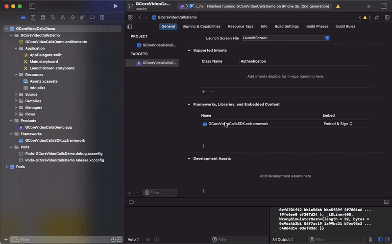
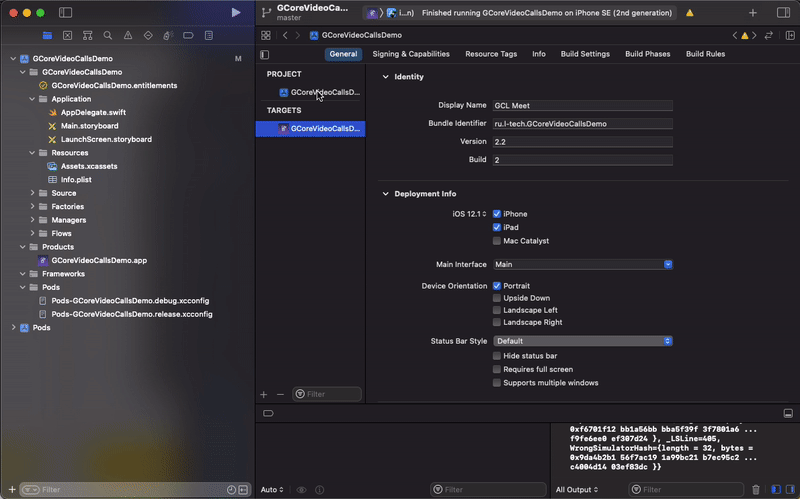

# Change Log

<!-- ## [2.2] - 2021-12-28 -->

<!-- ## SDK -->
<!-- ### Added -->
<!-- ### Changed -->
<!-- ### Fixed -->

<!-- ## Demo приложение -->
<!-- ### Added -->
<!-- ### Changed -->
<!-- ### Fixed -->

<!-- ---
<br><br> -->

## [2.4] - 2022-03-31

## SDK

---

- SDK собрано в XCode **13.3 (13E113)**

## Demo приложение

---

### Added

- Добавлены методы для работы с модератором (RoomListener), см. описание в [README.md](https://github.com/pahanius/gcorevideocallsdemo-ios#readme)

---
<br><br>
## [2.3] - 2022-01-13

## SDK

---

- SDK собрано в XCode **13.2.1 (13C100)** и будет работать только c соответствующим toolchain (**Apple Swift version 5.5.2 (swiftlang-1300.0.47.5 clang-1300.0.29.30)**)

## Demo приложение

---

### Added

- GCoreVideoCallsSDK.xcframework можно установить через Package Dependancies

Для установки через Package Dependancies нужно удалить GCoreVideoCallsSDK.xcframework из Targets->General->Frameworks, Libraries, and Embedded Content

<details>
  <summary>Remove Library (gif)</summary>



</details>
<br>

Добавить библиотеку, прописав в поиске Apple Swift Packages репозиторий https://github.com/pahanius/GCoreVideoCallsSDK.git

<details>
  <summary>Add Package (gif)</summary>



</details>
<br>

### Changed

- Библиотека GCoreVideoCallsSDK замена на GCoreVideoCallsSDK.xcframework

---
<br><br>
## [2.2] - 2021-12-28

## SDK

---

### Fixed

- Xcode 13 compatible
 
---
<br><br>
## [2.1] - 2021-08-19

## SDK

---
 
### Added

- *RoomListener protocol*

Добавлены 2 новых метода. На них можно вешать индикатор загрузки при переподключении SDK к серверам (Например, при прерывании работы приложения из-за поступившего звонка)

|Метод|Описание|
|-|-|
|roomClientStartToConnectWithServices()|Подключение SDK к сервисам.<br>Можно запустить лоадре загрузки|
|roomClientSuccessfullyConnectWithServices()|SDK успешно подключён к сервисам<br>Можно убрать лоадер загрузки|

- *GCoreRoomLogger*

Добавлено замыкание `log: ((_ message: String) -> Void)?`, которое возвращает логи от SDK

```swift
GCoreRoomLogger.log = { [weak self] message in
    print(message)
}
```
 
### Fixed

- audio stream works when the app did collapsed by the user
- reconnection to the room, if the app interapted by the phone call

## Demo приложение

---

### Added

- Вью для показа логов от SDK
- Работа в фоне + переподключение при звонке